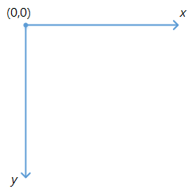

# css secret(css 揭秘)

> 本章主要介绍css3的背景知识

[TOC]


## rgba 和 hsla

​	css2.1，常用的背景颜色有RGB、HEX两种方法。RGB是一种加色模型，主要由红、绿、蓝三原色的光以不同的比例相加，以产生不同的色光。在css常用的方法如rgb(255,255,0)、rgb(23,34,45)。HEX与RGB类似，只不过采用16进制的形式表示颜色，如#FFFF00、#124567等。

​	css3 添加了rgba、hsl和hsla的方法。rgba在rgb的基础上，添加透明度alpha，其中alpha的值取0.0-1.0之间。hsl和hsla是对是对RGB色彩空间中点的两种有关系的表示，它们尝试描述比 RGB 更准确的感知颜色联系，并仍保持在计算上简单。其中色相（H）是色彩的基本属性，就是平常所说的颜色名称，如红色、黄色等，取0-360。饱和度（S）是指色彩的纯度，越高色彩越纯，低则逐渐变灰，取0-100%的数值。亮度（L），取0-100%。hsla在hsl的基础上，添加了透明度alpha。

> 本部分内容参照[w3c](https://www.w3.org/standards/)、[博客园](http://www.cnblogs.com/super-w/archive/2013/01/24/2874632.html)的内容，感谢两位作者。

​	通过一些实例说明rgb、rgba、hsl、hsla、hex的用法。

**定义公共的模块**

```css
      .demo {
			width: 200px;
			height: 200px;
			margin: 10px;
			text-align: center;
			line-height: 200px;
			display: inline-block;
      }
```

## **rgb**

​	css代码定于如下：

```css
		.bac-rgb {
			background: rgb(255,135,3);
		}
		.bac-rgb-2 {
			background: rgb(135,255,3);
		}
```

​	通过浏览器查看div的背景，发现如下图(ps注:background填充content-box 即包含content、padding的内容，不包括margin、border的内容 )


## **rgba**

​	css代码定义如下

```css
		.bac-rgba {
			background: rgba(255,135,3,0.0);
		}
		.bac-rgba-alpha-half {
			background: rgba(255,135,3,0.5);
		}
		.bac-rgba-alpha {
			background: rgba(255,135,3,1.0);
		}
```

​	通过浏览器查看显示的div，发现alpha为0时，背景完全透明，为0.5时，背景颜色有一定的虚化，为1时，与rgb显示相同。


## hex

​	css代码如下

```css
		.bac-hex {
			background: #FF8703;
		}
		.bac-hex-2 {
			background: #87FF03;
		}
```

​	通过浏览器查看显示的div，与rgb显示定义相同。


## hsl

​	rgb与hsl的转换方法可参加[csdn博客]([颜色空间RGB与HSV(HSL)的转换](http://blog.csdn.net/jiangxinyu/article/details/8000999)), 将rgb中的代码转换为hsl，css代码如下([在线转换](http://tools.jb51.net/color/rgb_hex_hsl))

```css
		.bac-hsl {
			background: hsl(31, 100.0%, 50.6%);
		}
		.bac-hsl-2 {
			background: hsl(89, 100.0%, 50.6%));
		}
```

​	显示内如如下图，hsl与rgb转换后，两者的显示背景是相同的。


## hsla

​	hsla是在hsl的基础上，添加了透明度，css代码如下

```css
		.bac-hsla {
			background: hsla(31, 100.0%, 50.6%, 0.0);
		}
		.bac-hsla-alpha-half {
			background: hsla(89, 100.0%, 50.6%, 0.5);
		}
		.bac-hsla-alpha {
			background: hsla(89, 100.0%, 50.6%, 1);
		}
```

​	显示如下图，与rgba的背景颜色是相同的


## 几种方法的使用方式

| 方法名称 |     使用方法      |                   参数说明                   |
| :--: | :-----------: | :--------------------------------------: |
| rgb  |  rgb(r,g,b)   |           红、绿、蓝三原色的值，默认取0-255            |
| rgba | rgba(r,g,b,a) |                a透明度，默认0-1                |
| hex  |     #RGB      |        红、绿、蓝三原色的值。默认000000-FFFFFF        |
| hsl  |  hsl(h,s,l)   | h取0-360 0-120 红 120-240 绿 240-360 蓝，s\l 0%-100% |
| hsla | hsla(h,s,l,a) |                a透明度，默认0-1                |

# border-radius

> 本部分内容参考[大漠](http://www.w3cplus.com/css3/border-radius)的博客内容

​	border-radisu的语法如下

```css
	border-radius ： none | <length>{1,4} [/ <length>{1,4} ]?
```

​	border-radius 是一种缩写方法。'/'前表示水平半径，后表示垂直半径。如果没有'/'，则表示水平和垂直半径相同。length四个值按照top-left、top-right、bottom-right、bottom-left的顺序来设置。


​	除此之外，与border、margin、padding类似，也可以使用如下单独定义圆角。

```css
border-top-left-radius: <length>  <length>   //左上角
border-top-right-radius: <length>  <length>  //右上角
border-bottom-right-radius:<length>  <length>  //右下角
border-bottom-left-radius:<length>  <length>   //左下角
```

​	通过以下案例，研究border-radius的使用方法

```css
		.bac {
			background: rgba(255,135,3,0.5);
		}
		.br-radius {
			border-radius: 50%;	
		}
		.br-radius-2 {
			border-radius: 10px 20px 30px 40px / 40px 30px 20px 10px;
		}
		.br-radius-3 {
			border-radius: 10px 20px 30px 40px;
		}
		.br-radius-4 {
			border-radius: 10px 20px 30px;
		}
		.br-radius-5 {
			border-radius: 10px 20px;
		}
		.br-radius-6 {
			border-radius: 10px;
		}
		.br-radius-top-left {
			border-top-left-radius: 20px 40px ;
		}
		.br-radius-top-left-single {
			border-top-left-radius: 20px;
		}
```

​	border-radius运行结果如下，border-radius还是有很强大的功能的


# text-shadow

> 本章内容主要参照[大漠](http://www.w3cplus.com/blog/52.html)博客内容。

**语法**

```css
text-shadow ： none | <length> none | [<shadow>, ] * <shadow> 或none | <color> [, <color> ]*
也就是：
text-shadow:[颜色(Color)  x轴(X Offset) y轴(Y Offset) 模糊半径(Blur)],[颜色(color) x轴(X Offset) y轴(Y Offset) 模糊半径(Blur)]...
或者
text-shadow:[x轴(X Offset) y轴(Y Offset)  模糊半径(Blur)  颜色(Color)],[x轴(X Offset) y轴(Y Offset)  模糊半径(Blur)  颜色(Color)]...
```

<length>：长度值，可以是负值。用来指定阴影的延伸距离。其中X Offset是水平偏移值，Y Offset是垂直偏移值

<color>：指定阴影颜色，也可以是rgba透明色

<shadow>：阴影的模糊值，不可以是负值，用来指定模糊效果的作用距离。

通过以下实例了解text-shadow的使用方法

```css
.text-shadow {
  text-shadow: red 0 1px 0;
}
.ts-neon {
  text-shadow: 0 0 20px red;
}
.ts-big-neon {
  text-shadow: 0 0 5px #fff, 0 0 10px #fff, 0 0 15px #fff, 0 0 40px #ff00de, 0 0 70px #ff00de;
}
```

​		text-shadow运用合理，可以产生不同的酷炫字体样式

​				

# box-shadow

> ​	本章内容主要参照[大漠](http://www.w3cplus.com/content/css3-box-shadow)博客内容。

语法

```css
box-shadow { box-shadow:inset x-offset y-offset blur-radius spread-radius color	}
```

​	box-shadow和text-shadow 一样可以使用一个和多个投影。

参数说明

阴影类型：可选参数，默认外阴影，inser 内阴影。

X-offset: 水平偏移量，可取正负值，正值阴影在对象右边，负值在对象的左边

Y-offset: 垂直偏移量，可取正负值，正值阴影在对象底部，负值在对象的顶部

阴影模糊半径：可选参数，只取正值，为0 表示无模糊效果

阴影扩展半径：可选参数，可取正负值，正值阴影扩大，负值阴影缩小

阴影颜色：可选参数，默认浏览器默认色

​	通过以下实例了解box-shadow的使用方法

```css
.bs {
	box-shadow: 3px 3px 1px #fb3;
}
.bs-inset {
  	box-shadow: inset 3px 3px 5px #fb3;
}
.bs-single {
  	box-shadow: -2px 0 0 green,
    	0 -2px 0 blue, 
    	0 2px 0 red, 
    	2px 0 0 yellow; 
}
```

​	box-shadow可以产生酷炫的边框效果。


# Gradient 渐变

​	css渐变有两种：线性渐变(linear-gradeint)、径向渐变(radial-gradient).

**线性渐变**

语法

```css
<linear-gradient> = linear-gradient([ [ <angle> | to <side-or-corner> ] ,]? <color-stop>[, <color-stop>]+)
<side-or-corner> = [left | right] || [top | bottom]
<color-stop> = <color> [ <length> | <percentage> ]?
```

下述值用来表示渐变的方向，可以使用角度或者关键字来设置：

**angel 用角度值指定渐变的方向（或角度）**

- to left：

  设置渐变为从右到左。相当于: 270deg

- to right：

  设置渐变从左到右。相当于: 90deg

- to top：

  设置渐变从下到上。相当于: 0deg

- to bottom：

  设置渐变从上到下。相当于: 180deg。这是默认值，等同于留空不写。

**color-stop 用于指定渐变的起止颜色**

- color 指定颜色。
- length 用长度值指定起止色位置。不允许负值 
- percentage 用百分比指定起止色位置。0 - 100%

通过实例了解linear-gradient 的使用方法

```scss
.linear-gradinet {
	background: linear-gradient(#ccc, #000);
}
.linear-gradinet-left {
	background:linear-gradient(to right, #ace, #f96);
}
.linear-gradinet-top {
	background:linear-gradient(#ace, #f96);
}
.linear-gradinet-left-top {
	background:linear-gradient(to bottom right, #ace, #f96);
}
.linear-gradinet-left-even {
	background: linear-gradient(to right, #ace, #f96, #ace, #f96, #ace); 
}
.line-gradient-Arb {
	background: linear-gradient(to right, #ace, #f96 5%, #ace, #f96 95%, #ace); 
}
.line-gradient-deg0 {
	background: -o-linear-gradient(0deg, #ace, #f96);
}
.line-gradient-deg45 {
	background: -o-linear-gradient(45deg, #ace, #f96);
}
.line-gradient-deg90 {
	background: -o-linear-gradient(90deg, #ace, #f96);
}
.line-gradient-deg135 {
	background: -o-linear-gradient(135deg, #ace, #f96);
}
.line-gradient-deg180 {
	background: -o-linear-gradient(180deg, #ace, #f96);
}
```

​	linear-gradient可以实现很酷炫的背景效果。


**径向渐变**

语法

```css
radial-gradient(
  [ [ circle || <length> ]                         [ at <position> ]? , |
    [ ellipse || [ <length> | <percentage> ]{2} ]  [ at <position> ]? , |
    [ [ circle | ellipse ] || <extent-keyword> ]   [ at <position> ]? , |
    at <position> ,
  ]?
  <color-stop> [ , <color-stop> ]+
)
where <extent-keyword> = closest-corner | closest-side | farthest-corner | farthest-side
  and <color-stop>     = <color> [ <percentage> | <length> ]
```

取值

**position确定圆心的位置。如果提供2个参数，第一个表示横坐标，第二个表示纵坐标；如果只提供一个，第二值默认为50%，即center。**

+ percentage 百分比表示横、纵坐标值，可取负值。
+ length 长度值表示横、纵坐标值可取负值。
+ left 表示横坐标的值为左侧
+ right 表示横坐标的值为右侧
+ top 表示纵坐标的值为顶部
+ bottom 表示纵坐标的值为底部
+ center 表示横、纵坐标值为中心

**shape 默认的形状**

+ circle 指定圆形的径向渐变
+ ellipse 指定椭圆形的径向渐变。

**extent-keyword**

+ closest-side 指定径向渐变的半径长度为从圆心到离圆心最近的边
+ closest-corner 指定径向渐变的半径长度为从圆心到离圆心最近的角
+ farthest-side 指定径向渐变的半径长度为从圆心到离圆心最远的边
+ farthest-corner 指定径向渐变的半径长度为从圆心到离圆心最远的角

**circle-size**

- circle接收为size

**ellipse-size**

+ ellipse 接受该值作为 size

**color-stop 用于指定渐变的起止颜色**

- color 指定颜色。
- length 用长度值指定起止色位置。不允许负值 
- percentage 用百分比指定起止色位置。0 - 100%

通过实例了解radial-gradient 的使用方法

```css
.radial-gradient {
  background: radial-gradient(ellipse farthest-corner at 45px 45px , #00FFFF 0%, rgba(0, 0, 255, 0) 50%, #0000FF 95%);
}
.radial-gradient-ellipse {
  background: radial-gradient(ellipse farthest-corner at 180px 47px , #FFFF80 20%, rgba(204, 153, 153, 0.4) 30%, #E6E6FF 60%);
}
.radial-gradient-circle {
  background-image: radial-gradient(farthest-corner at 45px 45px , #FF0000 0%, #0000FF 100%);
}
```

​	radial-gradient可以生成多种不同的背景样式，是css3背景利器。


# transform

语法

```css
   transform ： none | <transform-function> [ <transform-function> ]* 
```

​	transform-function一般是rotate(旋转)、translate(位移)、skew(倾斜)、scale(缩放)和martrix(矩阵)。

## 笛卡尔坐标系统

> 本部分内容参照[JackNEss](http://www.jackness.org/2014/10/03/css3-%E5%8A%A8%E7%94%BB%E7%9B%B8%E5%85%B3%E5%B1%9E%E6%80%A7-%E7%9F%A5%E8%AF%86%E6%A2%B3%E7%90%86-3d%E5%8F%98%E6%8D%A2/)

在说 3D变换之前必须了解的一个坐标系统，浏览器对元素进行 3D定位、渲染就是遵循这个笛卡尔坐标系统。

### 2D 笛卡尔坐标系统

​	2D 转换是沿着两个坐标轴定义，如下所示。



​	值得注意的是，y 轴是向下延伸，而非向上延伸，这是由于系统采用的是二维笛卡尔坐标系统。

​	坐标系统的 x 轴会沿着所要转换的元素节点向水平维度延伸， y 轴 则沿着垂直维度延伸。
​	此坐标系统的原点（图标中的 “（0，0）”）默认位于所要转换的元素的中心。可通过 transform-origin 属性改变。

### 3D 笛卡尔坐标系统


​	坐标系统的 z 轴同時与 x 和 y 轴垂直。
​	此坐标系统的原點 (图表中的 “(0,0,0)”) 也默认位于所要转换的元素的中心。同样可通过 transform-origin 属性改变。	

## rotate(旋转)

​	在进行平面转换时，可以使用rotate(angle)实现转换。

​	通过一下实例研究rotate 2D转换

```css
		.rotate-30deg {
			transform: rotate(30deg);
		}
		.rotate-120deg {
			transform: rotate(120deg);
		}
		.rotate-210deg {
			transform: rotate(210deg);
		}
		.rotate-300deg {
			transform: rotate(300deg);
		}
```

​	rotateX、rotateY、rotateZ和rotate3d通常用于定义立体空间的旋转，即定义3d的旋转。rotateX、rotateY、rotateZ和rotate3d的定义参数如下：

| rotate3d(*x*,*y*,*z*,*angle*) |    定义 3D 旋转。    |
| :---------------------------: | :-------------: |
|       rotateX(*angle*)        | 定义沿着 X 轴的 3D 旋转 |
|       rotateY(*angle*)        | 定义沿着 Y 轴的 3D 旋转 |
|       rotateZ(*angle*)        | 定义沿着Z 轴的 3D 旋转  |

​	通过一下实例研究rotate 3D转换

```css
.rotate {
			transform: rotate(0deg);
		}
		.rotate-30deg {
			transform: rotate(30deg);
		}
		.rotate-120deg {
			transform: rotate(120deg);
		}
		.rotate-210deg {
			transform: rotate(210deg);
		}
		.rotate-300deg {
			transform: rotate(300deg);
		}
		.rotateX-45deg {
			transform: rotateX(45deg);
		}
		.rotateX-90deg {
			transform: rotateX(90deg);
		}
		.rotateY-45deg {
			transform: rotateY(45deg);
		}
		.rotateY-90deg {
			transform: rotateY(90deg);
		}
		.rotateZ-45deg {
			transform: rotateZ(45deg);
		}
		.rotateZ-90deg {
			transform: rotateZ(90deg);
		}
		.rotate3d-45deg {
			transform: rotate3d(1, 1, 1, 45deg);
		}
		.rotate3d-90deg {
			transform: rotate3d(1, 1, 1, 90deg);
		}
```

​	效果如下:


## translate

​	translate可以实现平移功能，其中translate实现2d位移，translateX、translateX、translateZ和translate3d位3d转换。其使用方法如下：

|    translate(*x*,*y*)    |      定义 2D 转换。      |
| :----------------------: | :-----------------: |
| translate3d(*x*,*y*,*z*) |      定义 3D 转换。      |
|     translateX(*x*)      |   定义转换，只是用 X 轴的值。   |
|     translateY(*y*)      |   定义转换，只是用 Y 轴的值。   |
|     translateZ(*z*)      | 定义 3D 转换，只是用 Z 轴的值。 |

​	css代码如下：

```css
		.translate {
			transform: translate(30px,30px);
		}
		.translateX {
			transform: translateX(30px);
		}
		.translateY {
			transform: translateY(30px);
		}
		.translateZ {
			transform: translateZ(30px);
		}
		.translate3d {
			transform: translate3d(30px,30px,30px);
		}
```


​	效果如下

​	


## scale

​	scale可以实现缩放功能，其中scale实现2d缩放，scaleX、scaleY、scaleZ和scale3d实现3d缩放转换。其使用方法如下：

|    scale(*x*,*y*)    |      定义 2D 缩放转换。       |
| :------------------: | :--------------------: |
| scale3d(*x*,*y*,*z*) |      定义 3D 缩放转换。       |
|     scaleX(*x*)      |   通过设置 X 轴的值来定义缩放转换。   |
|     scaleY(*y*)      |   通过设置 Y 轴的值来定义缩放转换。   |
|     scaleZ(*z*)      | 通过设置 Z 轴的值来定义 3D 缩放转换。 |

​	css代码如下：

```css
		.scale-small {
			transform: scale(0.5, 0.5);
		}
		.scale-big {
			transform: scale(1.2, 1.2);
		}
		.scaleX {
			transform: scaleX(0.5);
		}
		.scaleY {
			transform: scaleY(0.5);
		}
		.scaleZ {
			transform: scaleZ(1.2);
		}
		.scale3d {
			transform: scale3d(0.5, 0.5, 1.2);
		}
```

​	效果如下：


## skew

​	skew可以实现缩放功能，其中skew、scaleX、scaleY都可以实现倾斜功能。其使用方法如下

| skew(*x-angle*,*y-angle*) | 定义沿着 X 和 Y 轴的 2D 倾斜转换。 |
| :-----------------------: | :--------------------: |
|      skewX(*angle*)       |   定义沿着 X 轴的 2D 倾斜转换。   |
|      skewY(*angle*)       |   定义沿着 Y 轴的 2D 倾斜转换。   |

## matrix

​	matrix、matrix3d矩阵可以实现平移、旋转和缩放等三种变换。

|     matrix(*n*,*n*,*n*,*n*,*n*,*n*)      |     定义 2D 转换，使用六个值的矩阵。     |
| :--------------------------------------: | :------------------------: |
| matrix3d(*n*,*n*,*n*,*n*,*n*,*n*,*n*,*n*,*n*,*n*,*n*,*n*,*n*,*n*,*n*,*n*) | 定义 3D 转换，使用 16 个值的 4x4 矩阵。 |

​	martrix矩阵的生成和计算方法可以参见[[杨名天吓](http://my.csdn.net/henren555)](http://blog.csdn.net/henren555/article/details/9699449/).


# transition

> 本部分内容参考[Airen的博客](http://www.w3cplus.com/blogs/airen)

语法

```javascript
transition ： [<'transition-property'> || <'transition-duration'> || <'transition-timing-function'> || <'transition-delay'> [, [<'transition-property'> || <'transition-duration'> || <'transition-timing-function'> || <'transition-delay'>]]* 
```

​	transition主要包含四个属性值：执行变换的属性：transition-property,变换延续的时间：transition-duration,在延续时间段，变换的速率变化transition-timing-function,变换延迟时间transition-delay。

## transition-property

语法

```css
  transition-property ： none | all | [ <IDENT> ] [ ',' <IDENT> ]*
```


​	 ransition-property是用来指定当元素其中一个属性改变时执行transition效果，其主要有以下几个值：none(没有属性改变)；all（所有属性改变）这个也是其默认值；indent（元素属性名）。当其值为none时，transition马上停止执行，当指定为all时，则元素产生任何属性值变化时都将执行transition效果，ident是可以指定元素的某一个属性值。ident常见的类型如color、length、percentage、interger、number、transform、rectangle、shadow和gradient等多种类型。

## **transition-duration**

语法

```css
 transition-duration ： <time> [, <time>]* 
```

​	transition-duration是用来指定元素 转换过程的持续时间，取值：time为数值，单位为s（秒）或者ms(毫秒),可以作用于所有元素，包括:before和:after伪元素。其默认值是0，也就是变换时是即时的。

## **transition-timing-function**

语法

```css
transition-timing-function ： ease | linear | ease-in | ease-out | ease-in-out | cubic-bezier(<number>, <number>, <number>, <number>) [, ease | linear | ease-in | ease-out | ease-in-out | cubic-bezier(<number>, <number>, <number>, <number>)]* 
```

* ease：（逐渐变慢）默认值，ease函数等同于贝塞尔曲线(0.25, 0.1, 0.25, 1.0).
* linear：（匀速），linear 函数等同于贝塞尔曲线(0.0, 0.0, 1.0, 1.0).
* ease-in：(加速)，ease-in 函数等同于贝塞尔曲线(0.42, 0, 1.0, 1.0).
* ease-out：（减速），ease-out 函数等同于贝塞尔曲线(0, 0, 0.58, 1.0).
* ease-in-out：（加速然后减速），ease-in-out 函数等同于贝塞尔曲线(0.42, 0, 0.58, 1.0)
* cubic-bezier：（该值允许你去自定义一个时间曲线）， 特定的[cubic-bezier曲线](http://en.wikipedia.org/wiki/B%C3%A9zier_curve)。 (x1, y1, x2, y2)四个值特定于曲线上点P1和点P2。所有值需在[0, 1]区域内，否则无效。

##   transition-delay  

语法

```css
transition-delay ： <time> [, <time>]* 
```

​	transition-delay是用来指定一个动画开始执行的时间，也就是说当改变元素属性值后多长时间开始执行transition效果，其取值：<time>为数值，单位为s（秒）或者ms(毫秒)，其使用和transition-duration极其相似，也可以作用于所有元素，包括:before和:after伪元素。 默认大小是"0"，也就是变换立即执行，没有延迟。

# transition

语法

```css
  @keyframes IDENT {
     from {
       Properties:Properties value;
     }
     Percentage {
       Properties:Properties value;
     }
     to {
       Properties:Properties value;
     }
   }
   或者
   @keyframes IDENT {
      0% {
         Properties:Properties value;
      }
      Percentage {
         Properties:Properties value;
      }
      100% {
         Properties:Properties value;
      }
    }
```

 	动画示例

```css
@-webkit-keyframes 'wobble' {
     0% {
        margin-left: 100px;
        background: green;
     }
     40% {
        margin-left: 150px;
        background: orange;
     }
     60% {
        margin-left: 75px;
        background: blue;
     }
     100% {
        margin-left: 100px;
        background: red;
     }
  }
```

## animation-name

**语法：**

```
  animation-name: none | IDENT[,none | IDENT]*;

```

 

**取值说明：**

​	animation-name:是用来定义一个动画的名称，其主要有两个值：IDENT是由Keyframes创建的动画名，换句话说此处的IDENT要和Keyframes中的IDENT一致，如果不一致,将不能实现任何动画效果；none为默认值，当值为none时，将没有任何动画效果。另外我们这个属性跟前面所讲的transition一样，我们可以同时附几个animation给一个元素，我们只需要用逗号“，”隔开。

## animation-duration

**语法：**

```
  animation-duration: <time>[,<time>]*

```

 

**取值说明：**

animation-duration是用来指定元素播放动画所持续的时间长，取值:time为数值，单位为s （秒.）其默认值为“0”。这个属性跟transition中的[transition-duration](http://www.w3cplus.com/content/css3-transition)使用方法是一样的。

## animation-timing-function

**语法：**

```
   animation-timing-function:ease | linear | ease-in | ease-out | ease-in-out | cubic-bezier(<number>, <number>, <number>, <number>) [, ease | linear | ease-in | ease-out | ease-in-out | cubic-bezier(<number>, <number>, <number>, <number>)]* 

```

 

**取值说明：**

animation-timing-function:是指元素根据时间的推进来改变属性值的变换速率，说得简单点就是动画的播放方式。他和transition中的[transition-timing-function](http://www.w3cplus.com/content/css3-transition)一样，具有以下六种变换方式：ease;ease-in;ease-in-out;linear;cubic-bezier。具体的使用方法大家可以点[这里](http://www.w3cplus.com/content/css3-transition)，查看其中transition-timing-function的使用方法。

## animation-delay

**语法：**

```
  animation-delay: <time>[,<time>]*

```

 

**取值说明：**

animation-delay:是用来指定元素动画开始时间。取值为time为数值，单位为s(秒)，其默认值也是0。这个属性和[transition-delay](http://www.w3cplus.com/content/css3-transition)y使用方法是一样的。

## animation-iteration-count

**语法：**

```
  animation-iteration-count:infinite | <number> [, infinite | <number>]* 

```

 

**取值说明：**

animation-iteration-count是用来指定元素播放动画的循环次数，其可以取值number为数字，其默认值为“1”；infinite为无限次数循环。

## animation-direction

**语法：**

```
  animation-direction: normal | alternate [, normal | alternate]* 

```

**取值说明：**

animation-direction是用来指定元素动画播放的方向，其只有两个值，默认值为normal，如果设置为normal时，动画的每次循环都是向前播放；另一个值是alternate，他的作用是，动画播放在第偶数次向前播放，第奇数次向反方向播放。

## animation-play-state

**语法：**

```
   animation-play-state:running | paused [, running | paused]* 
```

**取值说明：**

animation-play-state主要是用来控制元素动画的播放状态。其主要有两个值，running和paused其中running为默认值。他们的作用就类似于我们的音乐播放器一样，可以通过paused将正在播放的动画停下了，也可以通过running将暂停的动画重新播放，我们这里的重新播放不一定是从元素动画的开始播放，而是从你暂停的那个位置开始播放。另外如果暂时了动画的播放，元素的样式将回到最原始设置状态。这个属性目前很少内核支持，所以只是稍微提一下。

上面我们分别介绍了animation中的各个属性的语法和取值，那么我们综合上面的内容可以给animation属性一个速记法：

```
  animation:[<animation-name> || <animation-duration> || <animation-timing-function> || <animation-delay> || <animation-iteration-count> || <animation-direction>] [, [<animation-name> || <animation-duration> || <animation-timing-function> || <animation-delay> || <animation-iteration-count> || <animation-direction>] ]* 

```

 