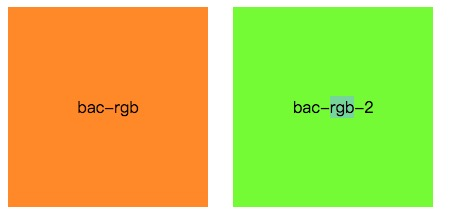

# css secret(css 揭秘)

> 本章主要介绍css3的背景知识

## rgba 和 hsla

​	css2.1，常用的背景颜色有RGB、HEX两种方法。RGB是一种加色模型，主要由红、绿、蓝三原色的光以不同的比例相加，以产生不同的色光。在css常用的方法如rgb(255,255,0)、rgb(23,34,45)。HEX与RGB类似，只不过采用16进制的形式表示颜色，如#FFFF00、#124567等。

​	css3 添加了rgba、hsl和hsla的方法。rgba在rgb的基础上，添加透明度alpha，其中alpha的值取0.0-1.0之间。hsl和hsla是对是对RGB色彩空间中点的两种有关系的表示，它们尝试描述比 RGB 更准确的感知颜色联系，并仍保持在计算上简单。其中色相（H）是色彩的基本属性，就是平常所说的颜色名称，如红色、黄色等，取0-360。饱和度（S）是指色彩的纯度，越高色彩越纯，低则逐渐变灰，取0-100%的数值。亮度（L），取0-100%。hsla在hsl的基础上，添加了透明度alpha。

> 本部分内容参照[w3c](https://www.w3.org/standards/)、[博客园](http://www.cnblogs.com/super-w/archive/2013/01/24/2874632.html)的内容，感谢两位作者。

​	通过一些实例说明rgb、rgba、hsl、hsla、hex的用法。

**定义公共的模块**

```css
      .demo {
			width: 200px;
			height: 200px;
			margin: 10px;
			text-align: center;
			line-height: 200px;
			display: inline-block;
      }
```

## **rgb**

​	css代码定于如下：

```css
		.bac-rgb {
			background: rgb(255,135,3);
		}
		.bac-rgb-2 {
			background: rgb(135,255,3);
		}
```

​	通过浏览器查看div的背景，发现如下图(ps注:background填充content-box 即包含content、padding的内容，不包括margin、border的内容 )



## **rgba**

​	css代码定义如下

```css
		.bac-rgba {
			background: rgba(255,135,3,0.0);
		}
		.bac-rgba-alpha-half {
			background: rgba(255,135,3,0.5);
		}
		.bac-rgba-alpha {
			background: rgba(255,135,3,1.0);
		}
```

​	通过浏览器查看显示的div，发现alpha为0时，背景完全透明，为0.5时，背景颜色有一定的虚化，为1时，与rgb显示相同。


## hex

​	css代码如下

```css
		.bac-hex {
			background: #FF8703;
		}
		.bac-hex-2 {
			background: #87FF03;
		}
```

​	通过浏览器查看显示的div，与rgb显示定义相同。


## hsl

​	rgb与hsl的转换方法可参加[csdn博客]([颜色空间RGB与HSV(HSL)的转换](http://blog.csdn.net/jiangxinyu/article/details/8000999)), 将rgb中的代码转换为hsl，css代码如下([在线转换](http://tools.jb51.net/color/rgb_hex_hsl))

```css
		.bac-hsl {
			background: hsl(31, 100.0%, 50.6%);
		}
		.bac-hsl-2 {
			background: hsl(89, 100.0%, 50.6%));
		}
```

​	显示内如如下图，hsl与rgb转换后，两者的显示背景是相同的。


## hsla

​	hsla是在hsl的基础上，添加了透明度，css代码如下

```css
		.bac-hsla {
			background: hsla(31, 100.0%, 50.6%, 0.0);
		}
		.bac-hsla-alpha-half {
			background: hsla(89, 100.0%, 50.6%, 0.5);
		}
		.bac-hsla-alpha {
			background: hsla(89, 100.0%, 50.6%, 1);
		}
```

​	显示如下图，与rgba的背景颜色是相同的


## 几种方法的使用方式

| 方法名称 |     使用方法      |                   参数说明                   |
| :--: | :-----------: | :--------------------------------------: |
| rgb  |  rgb(r,g,b)   |           红、绿、蓝三原色的值，默认取0-255            |
| rgba | rgba(r,g,b,a) |                a透明度，默认0-1                |
| hex  |     #RGB      |        红、绿、蓝三原色的值。默认000000-FFFFFF        |
| hsl  |  hsl(h,s,l)   | h取0-360 0-120 红 120-240 绿 240-360 蓝，s\l 0%-100% |
| hsla | hsla(h,s,l,a) |                a透明度，默认0-1                |

# border-radius

> 本部分内容参考[大漠](http://www.w3cplus.com/css3/border-radius)的博客内容

​	border-radisu的语法如下

```css
	border-radius ： none | <length>{1,4} [/ <length>{1,4} ]?
```

​	border-radius 是一种缩写方法。'/'前表示水平半径，后表示垂直半径。如果没有'/'，则表示水平和垂直半径相同。length四个值按照top-left、top-right、bottom-right、bottom-left的顺序来设置。


​	除此之外，与border、margin、padding类似，也可以使用如下单独定义圆角。

```css
border-top-left-radius: <length>  <length>   //左上角
border-top-right-radius: <length>  <length>  //右上角
border-bottom-right-radius:<length>  <length>  //右下角
border-bottom-left-radius:<length>  <length>   //左下角
```

​	通过以下案例，研究border-radius的使用方法

```css
		.bac {
			background: rgba(255,135,3,0.5);
		}
		.br-radius {
			border-radius: 50%;	
		}
		.br-radius-2 {
			border-radius: 10px 20px 30px 40px / 40px 30px 20px 10px;
		}
		.br-radius-3 {
			border-radius: 10px 20px 30px 40px;
		}
		.br-radius-4 {
			border-radius: 10px 20px 30px;
		}
		.br-radius-5 {
			border-radius: 10px 20px;
		}
		.br-radius-6 {
			border-radius: 10px;
		}
		.br-radius-top-left {
			border-top-left-radius: 20px 40px ;
		}
		.br-radius-top-left-single {
			border-top-left-radius: 20px;
		}
```

​	border-radius运行结果如下，border-radius还是有很强大的功能的


# text-shadow

> 本章内容主要参照[大漠](http://www.w3cplus.com/blog/52.html)博客内容。

**语法**

```css
text-shadow ： none | <length> none | [<shadow>, ] * <shadow> 或none | <color> [, <color> ]*
也就是：
text-shadow:[颜色(Color)  x轴(X Offset) y轴(Y Offset) 模糊半径(Blur)],[颜色(color) x轴(X Offset) y轴(Y Offset) 模糊半径(Blur)]...
或者
text-shadow:[x轴(X Offset) y轴(Y Offset)  模糊半径(Blur)  颜色(Color)],[x轴(X Offset) y轴(Y Offset)  模糊半径(Blur)  颜色(Color)]...
```

<length>：长度值，可以是负值。用来指定阴影的延伸距离。其中X Offset是水平偏移值，Y Offset是垂直偏移值

<color>：指定阴影颜色，也可以是rgba透明色

<shadow>：阴影的模糊值，不可以是负值，用来指定模糊效果的作用距离。

通过以下实例了解text-shadow的使用方法

```css
.text-shadow {
  text-shadow: red 0 1px 0;
}
.ts-neon {
  text-shadow: 0 0 20px red;
}
.ts-big-neon {
  text-shadow: 0 0 5px #fff, 0 0 10px #fff, 0 0 15px #fff, 0 0 40px #ff00de, 0 0 70px #ff00de;
}
```

​		text-shadow运用合理，可以产生不同的酷炫字体样式

​				

# box-shadow

> ​	本章内容主要参照[大漠](http://www.w3cplus.com/content/css3-box-shadow)博客内容。

语法

```css
box-shadow { box-shadow:inset x-offset y-offset blur-radius spread-radius color	}
```

​	box-shadow和text-shadow 一样可以使用一个和多个投影。

参数说明

阴影类型：可选参数，默认外阴影，inser 内阴影。

X-offset: 水平偏移量，可取正负值，正值阴影在对象右边，负值在对象的左边

Y-offset: 垂直偏移量，可取正负值，正值阴影在对象底部，负值在对象的顶部

阴影模糊半径：可选参数，只取正值，为0 表示无模糊效果

阴影扩展半径：可选参数，可取正负值，正值阴影扩大，负值阴影缩小

阴影颜色：可选参数，默认浏览器默认色

​	通过以下实例了解box-shadow的使用方法

```css
.bs {
	box-shadow: 3px 3px 1px #fb3;
}
.bs-inset {
  	box-shadow: inset 3px 3px 5px #fb3;
}
.bs-single {
  	box-shadow: -2px 0 0 green,
    	0 -2px 0 blue, 
    	0 2px 0 red, 
    	2px 0 0 yellow; 
}
```

​	box-shadow可以产生酷炫的边框效果。


# Gradient 渐变

​	css渐变有两种：线性渐变(linear-gradeint)、径向渐变(radial-gradient).

**线性渐变**

语法

```css
<linear-gradient> = linear-gradient([ [ <angle> | to <side-or-corner> ] ,]? <color-stop>[, <color-stop>]+)
<side-or-corner> = [left | right] || [top | bottom]
<color-stop> = <color> [ <length> | <percentage> ]?
```

下述值用来表示渐变的方向，可以使用角度或者关键字来设置：

**angel 用角度值指定渐变的方向（或角度）**

- to left：

  设置渐变为从右到左。相当于: 270deg

- to right：

  设置渐变从左到右。相当于: 90deg

- to top：

  设置渐变从下到上。相当于: 0deg

- to bottom：

  设置渐变从上到下。相当于: 180deg。这是默认值，等同于留空不写。

** color-stop 用于指定渐变的起止颜色**

- color 指定颜色。
- length 用长度值指定起止色位置。不允许负值 
- percentage 用百分比指定起止色位置。0 - 100%

