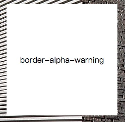
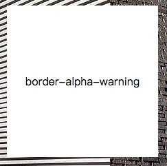
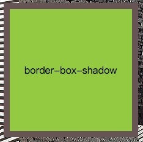
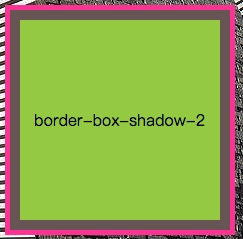
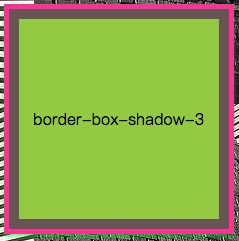
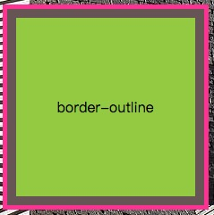
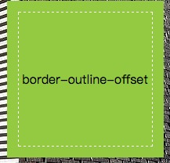
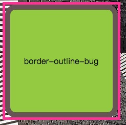

# 第二章 背景与边框

> ​	本章内容主要是css揭秘(css-secret)的学习笔记。

## 1. 半透明边框

​	css3引入了hsla和rgba后，可以利用透明度的特性，生成半透明边框。

​	假如我们给一容器设置白色背景和半透明白色边框，最初的代码，可能如下：

```css
.border-alpha-warning {
  border: 10px solid hsla(0, 0%, 100%, 0.5);
  background: white;
}	
.border-alpha {
	border: 10px solid hsla(0, 0%, 100%, 0.5);
	background: white;
	background-clip: padding-box;
}
```

​	效果图并未实现边框的透明效果，这是什么原因那? css中祖先级的原色的背景会延伸到边框的区域下层，这导致，半透明边框显示的容器自身的背景(容器自身颜色为纯白色背景)。

​	可以使css3的background-clip属性，将background的border-box(默认属性)改为padding-box, 这样半透明边框与祖先级背景处于同一背景层。

​	                                                          

​			  **未实现透明边框**                                                                                       **实现透明边框**


## 2. 多重边框

> ​	可以使用box-shadow和outline实现多重边框。

### box-shadow

​	使用box-shadow实现多重边框代码如下：

```css
.border-box-shadow {
	background: yellowgreen;
	box-shadow: 0 0 0 10px #655, 0 0 0 15px deeppink;
}
.border-box-shadow-2 {
	background: yellowgreen;
	box-shadow: 0 0 0 10px #655, 0 0 0 15px deeppink;
}
.border-box-shadow-3 {
	background: yellowgreen;
	box-shadow: 0 0 0 10px #655,
		0 0 0 15px deeppink,
		0 2px 5px 15px rgba(0, 255, 0, 0.6)
}
```

​	效果图如下

                 

​	         **单边框**                                                         **2层边框**                                                  **三层边框**

​	box-shadow是层层叠加的，第一层位于最顶层，依次类推。因此，在制作多层边框时，半径扩展要按照此规律依次扩展。如border-box-shadow-3中，box-shadow一层的长度10px、二层的长度15px、三层的长度15px，因此三层边框里一层边框10px、二层边框5px、三层边框0px，实现二重边框+5px的模糊面积。

### outline

> 使用outline方法结合border可以实现二重边框。

使用outline实现二重边框代码如下

```css
.border-outline {
 	background: yellowgreen;
 	border: 10px solid #655;
	outline: 5px solid deeppink;
}
.border-outline-offset {
	background: yellowgreen;
	border: 10px solid #655;
 	outline: 3px dashed deeppink;
  	outline-offset: -15px;
}
.border-outline-bug {
  	background: yellowgreen;
 	border: 10px solid #655;
  	outline: 5px solid deeppink;
 	border-radius: 20px;
}
```

​	效果如下:	

                            


+ outlines只适合双层边框
+ outline 在border-radius会产生间隙
+ outline 可以使offset产生内虚线

## 灵活的背景定位

​	