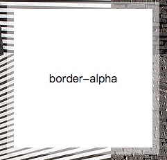

# 背景与边框

> ​	本章内容主要是css揭秘(css-secret)的学习笔记。

[TOC]


## 半透明边框

​	css3引入了hsla和rgba后，可以利用透明度的特性，生成半透明边框。

​	假如我们给一容器设置白色背景和半透明白色边框，最初的代码，可能如下：

```css
.border-alpha-warning {
  border: 10px solid hsla(0, 0%, 100%, 0.5);
  background: white;
}	
.border-alpha {
	border: 10px solid hsla(0, 0%, 100%, 0.5);
	background: white;
	background-clip: padding-box;
}
```

​	效果图并未实现边框的透明效果，这是什么原因那? css中祖先级的原色的背景会延伸到边框的区域下层，这导致，半透明边框显示的容器自身的背景(容器自身颜色为纯白色背景)。

​	可以使css3的background-clip属性，将background的border-box(默认属性)改为padding-box, 这样半透明边框与祖先级背景处于同一背景层。

​	                                                          

​			  **未实现透明边框**                                                                                       **实现透明边框**

## 多重边框

> ​	可以使用box-shadow和outline实现多重边框。

### box-shadow

​	使用box-shadow实现多重边框代码如下：

```css
.border-box-shadow {
	background: yellowgreen;
	box-shadow: 0 0 0 10px #655, 0 0 0 15px deeppink;
}
.border-box-shadow-2 {
	background: yellowgreen;
	box-shadow: 0 0 0 10px #655, 0 0 0 15px deeppink;
}
.border-box-shadow-3 {
	background: yellowgreen;
	box-shadow: 0 0 0 10px #655,
		0 0 0 15px deeppink,
		0 2px 5px 15px rgba(0, 255, 0, 0.6)
}
```

​	效果图如下

                 

​	         **单边框**                                                         **2层边框**                                                  **三层边框**

​	box-shadow是层层叠加的，第一层位于最顶层，依次类推。因此，在制作多层边框时，半径扩展要按照此规律依次扩展。如border-box-shadow-3中，box-shadow一层的长度10px、二层的长度15px、三层的长度15px，因此三层边框里一层边框10px、二层边框5px、三层边框0px，实现二重边框+5px的模糊面积。

### outline

> 使用outline方法结合border可以实现二重边框。

使用outline实现二重边框代码如下

```css
.border-outline {
 	background: yellowgreen;
 	border: 10px solid #655;
	outline: 5px solid deeppink;
}
.border-outline-offset {
	background: yellowgreen;
	border: 10px solid #655;
 	outline: 3px dashed deeppink;
  	outline-offset: -15px;
}
.border-outline-bug {
  	background: yellowgreen;
 	border: 10px solid #655;
  	outline: 5px solid deeppink;
 	border-radius: 20px;
}
```

​	效果如下:	

                            


+ outlines只适合双层边框
+ outline 在border-radius会产生间隙
+ outline 可以使offset产生内虚线

## 灵活的背景定位

​	可以使用css3中的background-position、background-origin实现背景定位。

​	实例代码如下

```css
.back-pos {
	background: url(code-position.svg) no-repeat bottom right #58a;
	background-position: right 20px bottom 10px;
}
.back-pos-origin {
	padding-right: 10px 20px;
	background: url(code-position.svg) no-repeat bottom right #58a;
	background-origin: content-box;
}
```

​	效果如下：

​                                

## 边框内圆角

​	有时需要一个容器，内侧有圆角，边框或描边在外部仍保持直角的形状。一般可以使用两个元素完成

```css
.something-meaningful {
	background: #655;
	padding: .8em;
}
.something-meaningful > div {
	background: tan;
	border-radius: .8em;
}
<div class="demo-block something-meaningful ">
	<div>
		old solution
	</div>
</div>
```

​	效果如下：

​                                                                     

​	使用css3的box-shadow、outline 也可以实现同样的效果。

```css
.new-something-meaningful {
  	background: tan;
  	border-radius: .8em;
    box-shadow:  0 0 0 .6em #655;
  	outline: .6em solid #655;
}
```

## 条纹背景

​	使用linear-gradient可以实现水平、垂直、斜向的条纹背景。

​	案例代码如下：

```css
.horizontal-stripe {
	background: linear-gradient(#fb3 50%, #58a 50%);
	background-size: 100% 30px;
}
.horizontal-stripe-three {
	background: linear-gradient(#fb3 33.3%, #58a 0, #58a 66.6%, yellowgreen 0);;
	background-size: 100% 45px;
}
.vertical-stripe {
	background: linear-gradient(90deg /* to right */, #fb3 50%, #58a 50%);
	background-size: 30px 100%;
}
.vertical-stripe-three {
	background: linear-gradient(90deg, #fb3 33.3%, #58a 0, #58a 66.6%, yellowgreen 0);;
	background-size: 45px 100%;
}
.diagonal-stripe-45deg{
	background: repeating-linear-gradient(45deg, #fb3, #fb3 15px, #58a 0, #58a 30px)
}
.diagonal-stripe-60deg{
	background: repeating-linear-gradient(60deg, #fb3, #fb3 15px, #58a 0, #58a 30px)
}
.same-color-stripe {
	background: repeating-linear-gradient(30deg, #79b, #79b 15px, #58a 0, #58a 30px);
}
.smale-color-stripe-better {
	background: #58a;
	background-image: repeating-linear-gradient(30deg, hsla(0, 0%, 100%, .1), hsla(0, 0%, 100%, .1) 15px, transparent, transparent 30px);
}
```


​	效果图如下, 使用linear-gradient可以实现多种的条纹效果。


## 复杂的背景图案

​	使用css渐变可以生成网格、波点和棋盘等多种背景图盘效果。

### 网格

​	网格可以利用水平波纹、垂直波纹的叠加阐述网格效果。

```css
.grid {
	background: white;
	background-image: linear-gradient(90deg, rgba(200, 0, 0, .5) 50%, transparent 0),
					  linear-gradient(rgba(200, 0, 0, .5) 50%, transparent 0);
	background-size: 30px 30px, 30px 30px;
}
```

​	background-image中linear-gradient(90deg, rgba(200, 0, 0, .5) 50%, transparent 0) 生成垂直波纹，linear-gradient(rgba(200, 0, 0, .5) 50%, transparent 0)生成水平波纹，垂直波纹与水平波纹重合形成网格背景。

                   	

​	**grid-bold-line**                						**grid**								**grid-line**		

​	有时，希望格子的大小可以调整，而网格线条粗细同时保持固定，可以使用如下代码实现

```css
.grid-line {
	background: #58a;
	background-image: linear-gradient(90deg, white 1px, transparent 0),
					  linear-gradient(white 1px, transparent 0);
	background-size: 30px 30px;
}
```

​	grid-line中background-image中前一个线性渐变生成垂直网格线，后一个渐变实现水平网格线。两者形成了一个同色下网格模型。甚至，在某些情况下，通过background-size生成不同的网格线。

```css
.grid-line-bold {
	background: #58a;
	background-image: linear-gradient( white 2px, transparent 0),
					  linear-gradient(90deg, white 2px, transparent 0),
					  linear-gradient(hsla(0, 0%, 100%, .3) 1px, transparent 0),
					  linear-gradient(90deg, hsla(0, 0%, 100%, .3) 1px, transparent 0);
  background-size: 75px 75px, 75px 75px,
					15px 15px, 15px 15px;
}
```


### 波点

​	径向渐变可以实现波点效果。

```css
.dots {
	background: #655;
	background-image: radial-gradient(tan 30%, transparent 0);
	background-size: 30px 30px;
}
.dots-tile {
  	background: #655;
  	background-image: radial-gradient(tan 30%, transparent 0),
   	 				  radial-gradient(tan 30%, transparent 0);
  	background-size: 30px 30px;
  	background-position: 0 0, 15px 15px;
}	
```

​	dots类使用radial-gradient实现了波点效果，但是dots的波点效果不是可以很实用，dots-tile结合使用background-position实现更好的波点效果。

​	

### 棋盘	

可以使lineear-gradietn构造复杂的棋盘效果。

```css
.checkerboard {
	background: #eee;
	background-image: linear-gradient(45deg, #bbb 25%, transparent 0), 
		linear-gradient(45deg,  transparent 75% ,#bbb 0), 
		linear-gradient(45deg, #bbb 25%, transparent 0), 
		linear-gradient(45deg,  transparent 75% ,#bbb 0);
	background-position: 0 0, 15px 15px, 15px 15px, 30px 30px;
	background-size: 30px 30px;
}
.checkerboard-better {
	background: #eee;
	background-image: linear-gradient(45deg, rgba(0, 0, 0, .25) 25%, transparent 0, 						transparent 75%, rgba(0, 0, 0, .25) 0), 
		linear-gradient(45deg, rgba(0, 0, 0, .25) 25%, transparent 0, transparent 75%, 						rgba(0, 0, 0, .25) 0) ;
	background-position: 0 0, 15px 15px;
	background-size: 30px 30px;
}
```

效果如下：


## 伪随机背景

​	可以使用质数原则生成伪随机化的背景。

```css
.more-random-bac {
	background: hsl(20, 40%, 90%);
	background-image: 
			linear-gradient(90deg, #fb3 11px, transparent 0),
			linear-gradient(90deg, #ab4 23px, transparent 0), 
			linear-gradient(90deg, #655 41px, transparent 0);
	background-size: 41px 100%, 61px 100%, 83px 100%;			
}
```

​	效果如下

	

## 连续的图像边框

​	传统的图像边框方法如下：

```css
.something-meaningful {
	background: url(../imgs/bg1.jpg);
	background-size: cover;
	padding: 1em;
}
.something-meaningful > div{
	background: white;
	padding: 1em;
}
<div class="something-meaningful">
	<div>
		I have a nice stone art border, don't I look pretty?
	</div>
</div>

```

​	css3的实现css代码如下：

```css
		.continuity-bac-better {
			padding: 1em;
			border: 1em solid transparent;
			background: linear-gradient(white, white), url(../imgs/bg1.jpg);
			background-size: cover;
			background-clip: padding-box, border-box;
			background-origin: border-box;
		}
		.continuity-bac-best {
			padding: 1em;
			border: 1em solid transparent;
			background: 
			     linear-gradient(white, white) padding-box, 
			     url(../imgs/bg1.jpg) border-box 0 / cover;
		}
```

​	效果如下：


